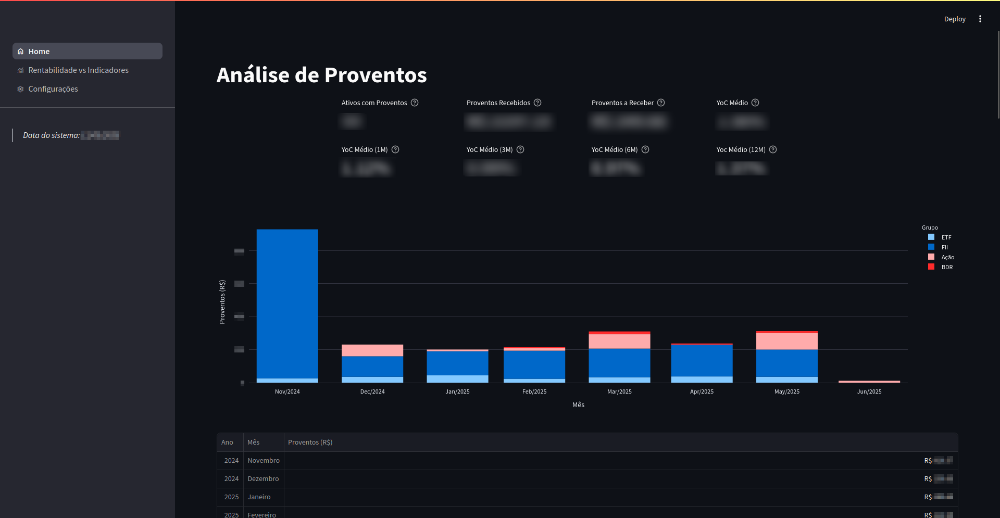
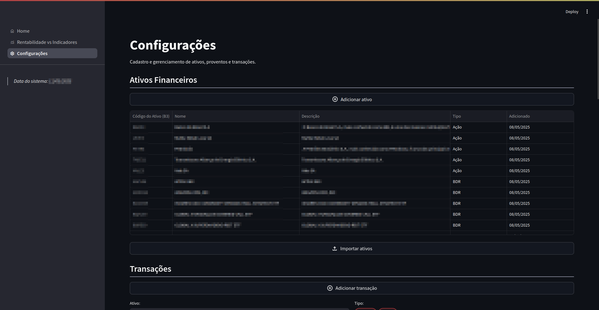
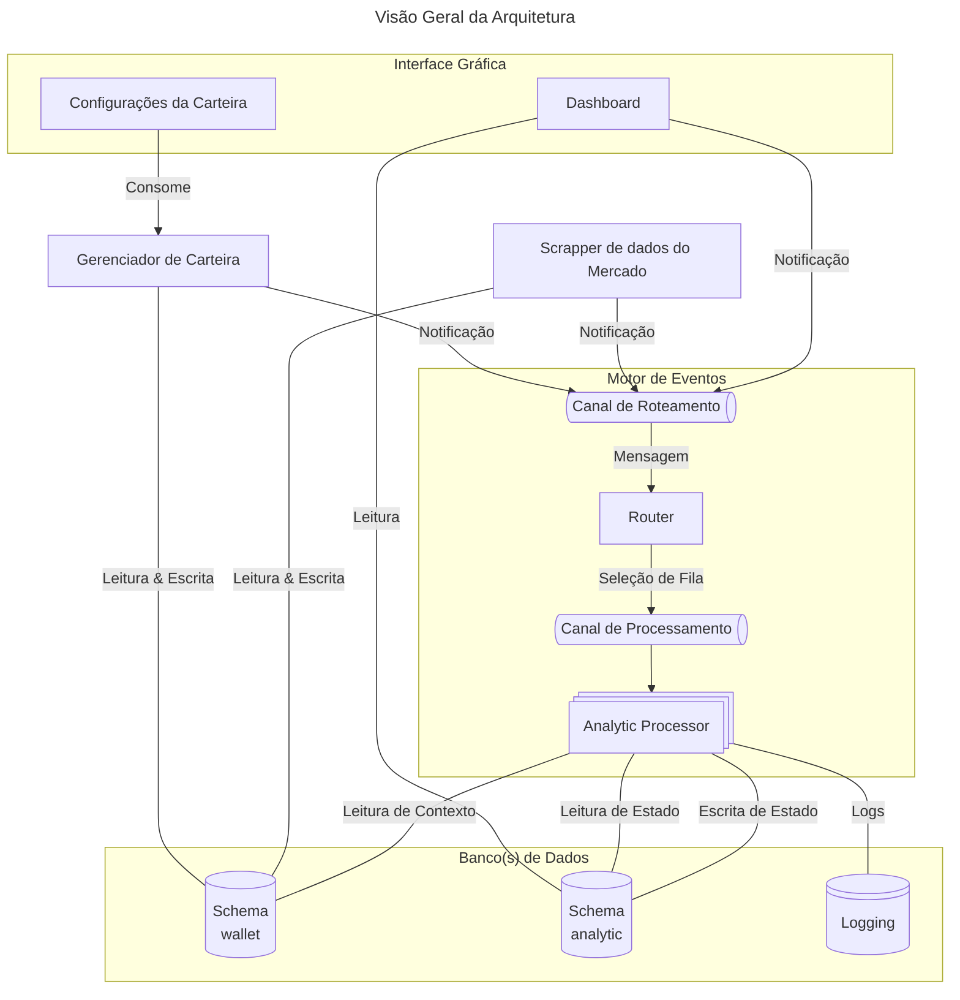

<h1 align="center">
  

  
  
  
  

  Dashboard para Análise de Proventos
   
</h1>

Dashboard simples para análise de proventos oriundos de investimentos financeiros com `streamlit`, `SQLAlchemy`, `alembic`, `pandas` e `RabbitMQ`. Esse é um projeto protótipo com o intuito de explorar diferentes tecnologias e arquiteturas para sistemas de análises de dados.

Uma descrição geral da arquitetura se encontra em [`docs`](docs/architecture.md). O repositório é organizado da seguinte forma:

- [`common`](./common): biblioteca utilitária com definições padrões compartilhadas pelos diferentes componentes do sistema;
- [`wallet-api`](./wallet-api): API RESTFul para gerenciamento de uma carteira de investimentos e dados econômicos;
- [`market-scrapers`](./market-scrapers): scrapers de dados do mercado;
- [`event-engine`](./event-engine): motor de eventos, reage a diferentes notificações emitidas pelo sistema e gera análises;
- [`dashboard`](./dashboard): interface gráfica para o dashboard e gerenciamento de carteira;

## Quickstart

Para acessar o dashboard localmente, basta executar o comando `make` ou executar o docker-compose presente na raiz do diretório (i.e., `docker compose up`). O dashboard é disponibilizado localmente na porta `8082`.

Para configurações dos diferentes componentes, checar seus respectivos diretórios.

### Adicionando Ativos, Proventos e Dados Econômicos

O dashboard possui uma seção simplificada de cadastro de ativos e proventos, incluindo adição a partir de arquivos CSV. Todavia, o dashboard e a API ainda não oferecem suporte nativo para remoção/deleção de items, sendo necessário se comunicar diretamente com o banco de dados.

## Arquitetura

O diagrama abaixo contém uma visão geral da arquitetura do sistema, que consiste em uma arquitetura híbrida baseada em eventos. Para mais informações, checar a [documentação](./docs/architecture.md).

