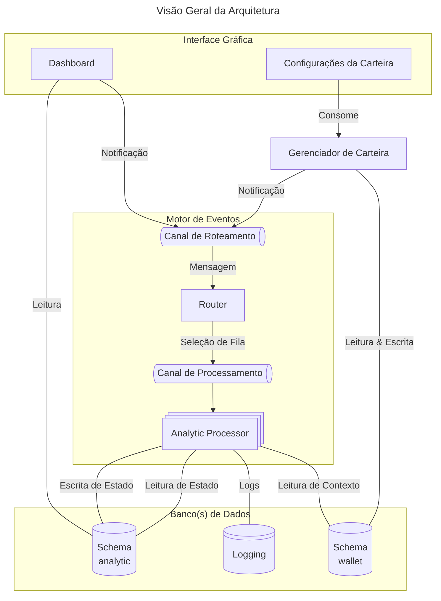

# Arquitetura da Aplicação

Esse documento contém a arquitetura utilizada pela aplicação.

## Descrição & Requisitos

> A aplicação é um dashboard que permite a análise de proventos recebidos por investimentos em ativos financeiros negociados na B3. Permitindo ao investidor analisar os retornos de cada ativo ou classe de ativo.

- **Usuários**: 1 por deploy;
- **Requisitos**:
    - _Cadastro_
        - Permitir o cadastro de diferentes ativos;
        - Permitir o cadastro de transações envolvendo os ativos;
        - Permitir o cadastro de proventos distribuídos por ativos;
        - Permitir o cadastro de índices econômicos a nível mensal;
        - (jun/25) Coleta automática de dados de mercado dos ativos;
    - _Visualização_
        - Cálculo de métricas relacionadas com YoC (Yield on Cost);
        - Cálculo de rendimentos _versus_ índices econômicos (e.g., CDI, IPCA);
        - Quantidade total de proventos recebidos e a receber;
        - Análise por classe de ativo (e.g., Ação, ETF, FII, BDR);
        - (jun/25) Visualização da posição de investimentos;
- **Contexto Adicional**:
    - É possível que a aplicação possua dados relativos à um grande período de tempo;
    - A visualização deve ser atualizada sempre que os dados atualizarem;
    - Deve ser possível expandir as visualizações existentes na aplicação;
    - Deve ser possível expandir o escopo da aplicação no futuro (e.g., preço atual dos ativos na bolsa, scrapping de dados);

## Características Arquiteturais

> Essa lista é um mapeamento das características arquiteturais mais importantes do sistema.

- _Availability_: a UI deve estar disponível 24/7 mostrando as análises mais recentes realizadas pelo sistema e permitindo atualizações na carteira;
- _Extensibility_: o sistema precisa ser extensível para novas visualizações e análises;
- _Performance_: o sistema precisa ser capaz de processar um grande conjunto de dados;

## Componentes

Das características, é possível visualizar uma estrutura com os seguintes componentes:

- Componentes de configurações da carteira;
  - Cadastro, remoção, atualização;
- Componentes de análise;
  - Responsável por realizar uma análise; 
- Interface gráfica para acesso às funcionalidades;

## Estilo Arquitetural

Dado as características do sistemas, uma arquitetura híbrida baseada na _Event-Driven Architecture_ com topologia _Broker_ foi selecionada. Em particular, existe um componente síncrono para o gerenciamento de carteiras e um outro componente assíncrono para geração de análises. Essa escolha se baseia no fato que o sistema como um todo responde a algum tipo de evento. Por exemplo, ao se cadastrar um novo _provento_ para um dado _ativo_, é necessário a execução de múltiplas análises para essa entrada (e.g., YoC, equivalências, etc).

## Decisões Arquiteturais

O diagrama abaixo contém uma visão geral das decisões tomadas. Em especial, cabe destacar:

- Tanto o dashboard quanto o módulo de gerenciamento de carteira lêem diretamente dos bancos;
    - Em ambos os casos, são enviadas notificações ao `Router` das ações que tomaram (e.g., leitura de dados de análise X, atualição de ativo Y);
    - O `Router` envia essa notificação ao canal apropriado;
    - Tradeoffs
        - Acomplamento nos schemas dos bancos por todo sistema (mitigada por schemas idenpendentes);
        - _Bottleneck_ por conta das chamadas síncronas de acesso ao banco;
        - Em contrapartida, reduz a complexidade do sistema;
        - Ambos pontos podem ser mitigados com o uso de uma arquitetura Space-based ao custo de um aumento de complexidade;
- Deve existir um canal de comunicação para cada _domínio_ de processadores;
    - Processadores se comunicam através desse domínio;
    - Processadores são livres para reagir a qualquer evento desse canal;
    - Processadores não devem possuir conhecimento de outros processadores ou componentes do sistema;
    - Processadores devem enviar seus _logs_ para o componente de _logging_;
  

