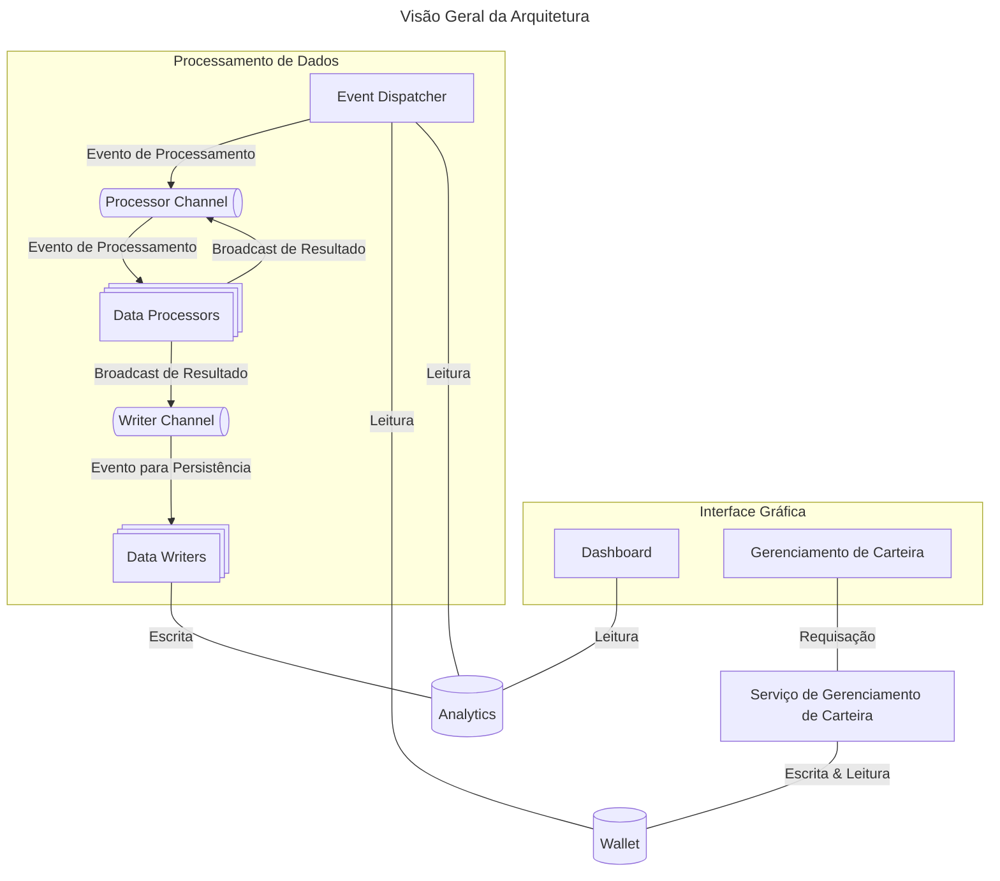

# Arquitetura da Aplicação

Esse documento contém a arquitetura utilizada pela aplicação.

## Descrição & Requisitos

> A aplicação é um dashboard que permite a análise de proventos recebidos por investimentos em ativos financeiros negociados na B3. Permitindo ao investidor analisar os retornos de cada ativo ou classe de ativo.

- **Usuários**: 1 por deploy;
- **Requisitos**:
    - _Cadastro_
        - Permitir o cadastro de diferentes ativos;
        - Permitir o cadastro de transações envolvendo os ativos;
        - Permitir o cadastro de proventos distribuídos por ativos;
        - Permitir o cadastro de índices econômicos a nível mensal;
    - _Visualização_
        - Cálculo de métricas relacionadas com YoC (Yield on Cost);
        - Cálculo de rendimentos _versus_ índices econômicos (e.g., CDI, IPCA);
        - Quantidade total de proventos recebidos e a receber;
        - Análise por classe de ativo (e.g., Ação, ETF, FII, BDR);
- **Contexto Adicional**:
    - É possível que a aplicação possua dados relativos à um grande período de tempo;
    - A visualização deve ser atualizada sempre que os dados atualizarem;
    - Deve ser possível expandir as visualizações existentes na aplicação;
    - Deve ser possível expandir o escopo da aplicação no futuro (e.g., preço atual dos ativos na bolsa, scrapping de dados);

## _Quantas_ Arquiteturais

Pela descrição do problema, é possível identificar dois _quanta_ arquiteturais. Especificamente, existem dois conjuntos de características arquiteturais distintas:

- Quanta de UI/Dashboard: _lightweight_, sempre disponível, responsivo;
- Quanta de Processamento: análises e processamento, performance e escalabilidade;

### Características Arquiteturais

> Essa lista é um mapeamento das características arquiteturais mais importantes do sistema.

#### Quanta I: UI/Dashboard

- _Availability_: a UI deve estar disponível 24/7 mostrando as análises mais recentes realizadas pelo sistema e permitindo atualizações na carteira;
- _Extensibility_: o sistema precisa ser extensível para novas visualizações;

#### Quanta II: Processamento

- _Performance_: o sistema precisa ser capaz de processar um grande conjunto de dados;
- _Scalability_: o sistema deve ser escalável com um aumento na quantidade de análises;
- _Extensibility_: o sistema precisa ser extensível para realização de novas análises;

## Componentes

Das características, é possível visualizar uma estrutura com 3 componentes principais:

- O primeiro componente é responsável por configurações da carteira;
- O segundo componente é responsável pela geração das visualizações;
- O último componente é responsável pelo processamento dos dados;

## Estilo Arquitetural

Dado as características do sistemas, o ideal é uma arquitetura que suporte múltiplos quanta arquiteturais. Dessa forma, a Arquitetura Baseada em Serviços foi selecionada.

## Decisões Arquiteturais

Devem existir 2 serviços principais e uma interface gráfica. Em particular, tais componentes devem ser responsáveis pelo seguinte:

- Serviço de Gerenciamento de Carteira: permite o cadastro e atualizações nos dados da carteira (e.g., proventos, transações, ativos);
    - Deve apenas realizar transações ACID;
    - Responsável pelo schema/banco `wallet`;
- Serviço de Processamento de Dados: realiza análises suportadas pelo sistema;
    - Deve ser organizado utilizando uma arquitetura Event-Driven;
    - Coordenação mínima, deve utilizar uma topologia `Mediator` com função exclusiva de `Dispatcher`;
        - O `Dispatcher` é responsável por emitir os eventos de processamento;
        - Ele deve ler o estado de `wallet` de forma agendada e emitir eventos de processamento conforme necessário;
    - Escrita no Banco deve ser realizada por processadores específico (e.g., `DataWriter`);
        - Tais processadores são responsáveis por escolher como e quando as análises realizadas pelo sistema serão persistidas no banco da aplicação;
        - Deve ser _stateful_ (i.e., deve conhecer o estado atual do banco, bem como dados que precisam ser escritas);
    - Processadores de análise devem ser _stateless_ e operar sobre os dados recebidos como entrada;
        - Devem produzir novos eventos indicando a finalização da análise (bem como o resultado);
    - Responsável pelo schema/banco `analytics`;
- Interface Gráfica: composto pelo dashboard e UI para gerenciamento da carteira;
    - Emite eventos para o serviço de processamento;
    - Consome funcionalidades do serviço de gerenciamento de carteira;
    - Criar dashboards das análises presentes em `analytics` (read-only);
    - Deve ser organizado como um monolito modular;
        - Limitar reuso entre páginas da interface;
        - O máximo a ser compartilhado são utilidades agnósticas ao domínio;

